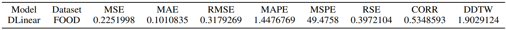

#  EasyTS: The Express Lane to Long Time Series Forecasting

We introduce EasyTS, a comprehensive toolkit engineered to streamline the complex procedures of data collection, analysis, and model creation.  

[//]: # (### Paper)

[//]: # ([Modeling Long- and Short-Term Temporal Patterns with Deep Neural Networks]&#40;https://arxiv.org/abs/1703.07015&#41;)

# Overview

The overall architecture of this toolkit is illustrated in Figure 1.
EasyTS is structured into three progressively advanced lev-
els. Initially, it offers a one-stop solution for datasets, allow-
ing users to easily download and import richly-scenarioed
time series datasets with a single click through dataloader.
Subsequently, the toolkit embeds a variety of preprocessing
and convenient visualization analysis tools to aid researchers
in feature extraction and analysis. Building on this, an intu-
itive model building and validation interface is implemented
for rapid model development and assessment. In this stage,
EasyTS provides diverse evaluation metrics and benchmark
models to ensure comprehensive and in-depth model evalu-
ation.

    
     
    
Figure 1: An overview of EasyTS

## Rich One-stop Datasets Service

EasyTS currently encompasses multiple datasets from six different domains around the world, 
with specific details provided in Figure 2. EasyTS introduces four novel opensource datasets related to electrical energy: FOOD, MANU,
PHAR, and OFFICE (Red indicates).

    
     
    
Figure 2: Datasets included in EasyTS

For detailed information about the dataset, please refer to the readme file in the "dataset" folder.

## Convenient Data Visualization Component

EasyTS extends a versatile array of analytical tools, elegantly illustrated in Figure 3.

    
     
    
Figure 3: Various analytical tools provided by EasyTS

## Convenient Model Verification Interface
Based on the two aspects mentioned above, scholars can swiftly design their own models within the toolkit's specified modules. EasyTS provides diverse time-series evaluation metrics, such as MSE, MAE, DDTW, CORR, RMSE, to objectively assess the sophistication of the models, with the scoring results displayed in Figure 4.

    
     
    
Figure 4: Diverse time-series evaluation metrics

