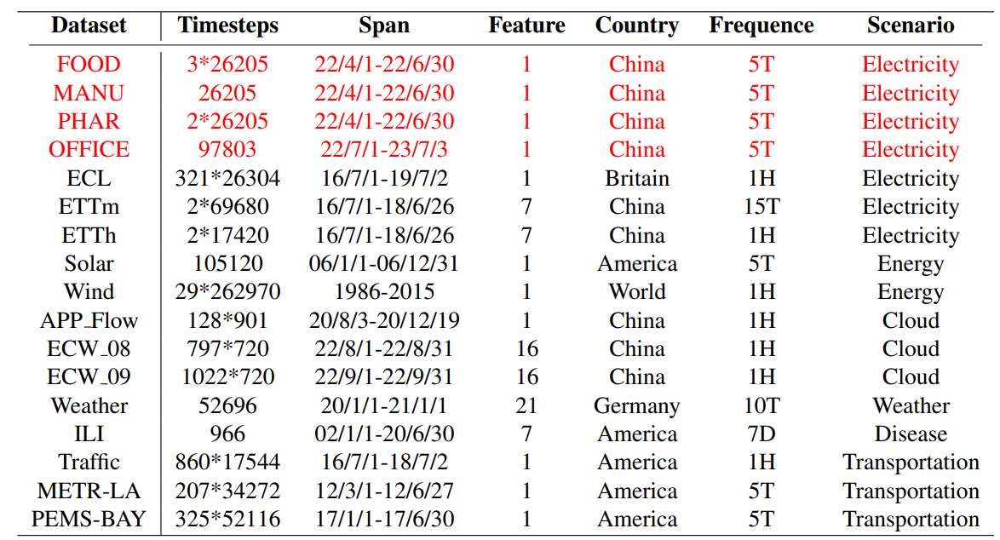

#  Datasets 

EasyTS currently encompasses multiple datasets from six different domains around the world, 
with specific details provided in Figure 2. EasyTS introduces four novel opensource datasets related to electrical energy: FOOD, MANU,
PHAR, and OFFICE (Red indicates).

    
     

### Electricity:
This dataset contains multiple power datasets, and the following is a list:

#### 1.PHAR (Pharmaceutical industry)
This dataset contains data on the maximum power demand (MD) for Pharmaceutical industries in Tianjin. 
The data includes two different pharmaceutical factories, corresponding to PHAR1 and PHAR2, 
and all the data is sourced from the electricity consumption records.

#### 2.FOOD (Food industry)
This dataset contains data on the maximum power demand (MD) for Food industries in Tianjin. 
The data includes three different food factories, corresponding to FOOD1, FOOD2, and FOOD3. 
All of this data is sourced from electricity consumption records.

#### 3.MANU (Manufacturing industry)
This dataset contains data on the maximum power demand (MD) for Manufacturing industries in Tianjin. 
The data is collected from the electricity consumption records.

#### 4.OFFICE (Office building)
This dataset contains data on the maximum power demand (MD) for Office buildings in Tianjin. 
The data consists of two different office buildings, with data collected at a minute-level 
frequency for OFFICEm and an hourly-level frequency for OFFICEh. 

### Transportation
#### 1.traffic
The raw data is in http://pems.dot.ca.gov. The data in this repo is a collection of 48 months (2015-2016) hourly data from the California Department of Transportation. The data describes the road occupancy rates (between 0 and 1) measured by different sensors on San Francisco Bay area freeways.

#### 2.METR-LA
This raw data is in https://github.com/liyaguang/DCRNN. This traffic dataset
contains traffic information collected from loop detectors in the highway of Los Angeles County. The dataset comprises 207 sensors and 4 months of data, spanning from March 1, 2012, to June 30, 2012.

#### 3.PEMS-BAY
This raw data is in https://github.com/liyaguang/DCRNN. This traffic dataset is collected by California Transportation Agencies (CalTrans) Performance Measurement System (PeMS). The dataset comprises 325
sensors in the Bay Area and 6 months of data ranging from Jan 1st 2017 to May 31th 2017.

### Cloud
#### 1.ECW_08

#### 2.ECW_09

#### 3.APP_FLOW
The raw data is in https://github.com/ant-research/Pyraformer. 
This dataset was collected at Ant Group3. It consists of hourly maximum traffic flow for 128 systems 
deployed on 16 logic data centers, resulting in 1083 different time series in total. 
